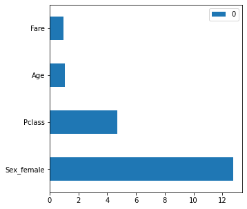
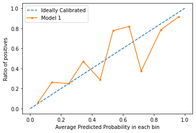
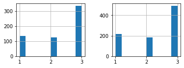
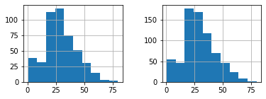
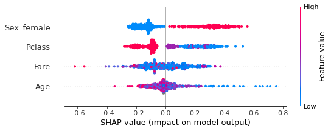
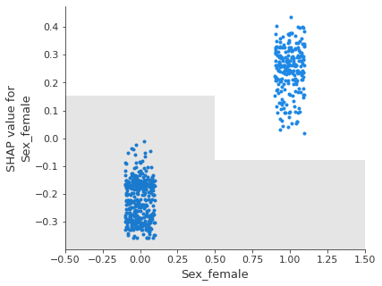
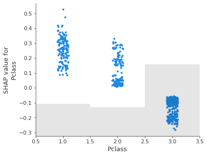
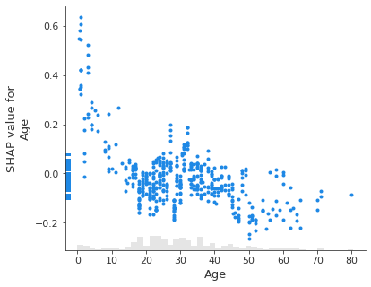
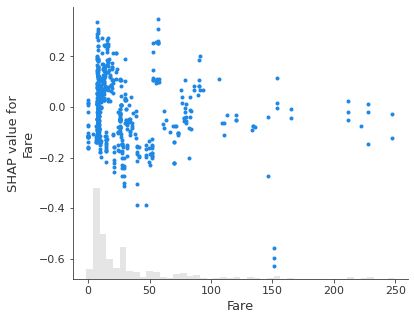

# model_diagnostic
Get a full diagnostic of a trained model: 
- Feature importance
- Perfomance metrics
- Feature distributions
- Model performance by features values
- False negatives profiling
- Global Shap values
- Shap partial depence plots
- Local shap values plots

# How it works
The framework uses the tracking_models module (Already on the repo), so its necesary to have your model saved by the tracking_models.save_model function

In order to get the diagnostic you only need to specify the following parameters on the model_diagnostic function:

- X_train: Data the model used for the training phase

- y_train: Target data the model used for the training phase

- X_test: Data the model used for the test phase

- y_test: Target data the model used for the test phase

- dir_results_files: Directory from the tracking models package where the metrics, stats and other files are stored.

- dir_models: Directory from the tracking models package where the models are stored.

- model_id: Model id you want to diagnose

- model_id2: Model id you want to compare

- umbral_elegido: Chosen threshold for making the predictions

- limit_imp: Qty of features youn want to see on the feature importance section 

- model_name: Name how you identify the model (Can be anything) 

- model_name2: Name how you identify the 2nd model (Can be anything) 

- data_for_comparison: Data you want to use for comparing with the training data distribution 

- return_model_metrics: If you want to show the model metrics

- return_feature_importance_gini: If you want to show the  feature importance using gini method

- return_compare_data_dist: If you want to show features distribution compared with other data

- return_performance_by_segment: If you want to show the model performance by segment

- return_profiling_false_negatives: If you want to show the model metrics false negatives profiling

- return_shap: If you want to show the model shap analysis

- return_feature_importance_permutation: If you want to show the  model feature importance by permutation

# Example

## Model metrics
    ===== Mostrando Las metricas del modelo

    === Model 1
    Tipo_metrica          Clasificacion
    Tipo_modelo                       1
    Algoritmo             XGBClassifier
    umbral                          0.5
    AUC                        0.841667
    Gini                       0.683333
    F1_score                   0.761797
    Accuracy                   0.772881
    Recall                     0.762738
    Precision                  0.765568
    Fecha           2023-02-21 21:35:00
    Comentario                      NaN
    Name: Your_user_name-21213528, dtype: object

## Feature importance
    
    === Model 1
    

## Model calibration

## Analyzing features distributions

    
    ===== Comparing features distribution
    
    Pclass
    Media Data Training: 2.337248322147651 
     Media Data comparison: 2.308641975308642
    

    Con Pclass SON IGUALES
    
    -----------------------------
    
    Age
    Media Data Training: 29.525983263598327 
     Media Data comparison: 29.69911764705882
    

    Con Age SON IGUALES
    
    -----------------------------
    
    Sex_female
    Media Data Training: 0.34563758389261745 
     Media Data comparison: 0.35241301907968575

## Global shap values

    
    ====== Creating shap values
    
    Sampling dataset
    
    Truncating outliers
    
    ====== Creating TREE shap values
    
    ======== TREE show_global_explainer
    

## Partial dependence plots shap values

    
    ======== show_partial_dependence_plot
    Sex_female 0.9452049256130524
    

    Pclass -0.9231761544537408
    

    Age -0.5607110421420823
    

    Fare -0.1903939153139222
    

