```python
import model_diagnostic_utils as md
import pandas as pd
from sklearn.model_selection import train_test_split
```


```python
df = pd.read_csv('Titanic_train.csv')

df = pd.get_dummies(df,columns=['Sex'])
features = ['Pclass','Age','Sex_female','Fare']
target = 'Survived'
X = df[features]
y = df[target]
X_train, X_test, y_train, y_test = train_test_split(X, y, test_size=0.33, random_state=42)
```


```python
dir_results_files = 'results_files'
dir_models = 'models'

model_id = 'Your_user_name-21213528'
model_id2 = 'Your_user_name-21213533'

umbral_elegido = 0.5
umbral_elegido2 = 0.5

limit_imp = 5

model_name = 'Model 1'
model_name2 = 'Model 2'

data_for_comparison = df[list(X_train.columns)+[target]]
```


```python
dicc_return = md.model_diagnostic(X_train,
                    y_train,
                    X_test,
                    y_test,
                    target,
                    dir_results_files,
                    dir_models,
                    model_id,
                    model_id2,
                    umbral_elegido,
                    umbral_elegido2,
                    limit_imp,
                    model_name,
                    model_name2,
                    data_for_comparison,
                    porcentaje_df_sample=0.7,
                    existing_shap_values=None,
                    existing_df_shap_values=None,
                    existing_shap_values_df_compare=None,
                    existing_df_shap_values_df_compare=None,
                    truncate_out = 1,
                    skew_validation_out_shap = 0,
                    use_normal_shap=0,
                    sample_size_local_shap = 5,
                    return_model_metrics=1,
                    return_feature_importance_gini=1,
                    return_model_calibration_curve=1,
                    return_compare_data_dist=1,
                    return_performance_by_segment=0,
                    return_profiling_false_negatives=0,
                    return_shap=1,
                    return_shap_df_compare=0,
                    return_feature_importance_by_perm=0,
                    )
```

    
    ===== Mostrando Las metricas del modelo
    
    === Model 1
    Tipo_metrica          Clasificacion
    Tipo_modelo                       1
    Algoritmo             XGBClassifier
    umbral                          0.5
    AUC                        0.841667
    Gini                       0.683333
    F1_score                   0.761797
    Accuracy                   0.772881
    Recall                     0.762738
    Precision                  0.765568
    Fecha           2023-02-21 21:35:00
    Comentario                      NaN
    Name: Your_user_name-21213528, dtype: object
    
    == Confusion matrix
    --- Absoluto
    


    true_positive      85
    true_negative     158
    false_positive     17
    false_negative     35
    Name: result, dtype: int64


    
    --- Relativo
    


    true_positive     0.2881
    true_negative     0.5356
    false_positive    0.0576
    false_negative    0.1186
    Name: result, dtype: float64


    
    === Model 2
    Tipo_metrica          Clasificacion
    Tipo_modelo                       1
    Algoritmo             XGBClassifier
    umbral                          0.5
    AUC                         0.82381
    Gini                       0.647619
    F1_score                   0.738584
    Accuracy                   0.749153
    Recall                     0.740119
    Precision                  0.740949
    Fecha           2023-02-21 21:35:00
    Comentario                      NaN
    Name: Your_user_name-21213533, dtype: object
    
    == Confusion matrix
    --- Absoluto
    


    true_positive      88
    true_negative     150
    false_positive     25
    false_negative     32
    Name: result, dtype: int64


    
    --- Relativo
    


    true_positive     0.2983
    true_negative     0.5085
    false_positive    0.0847
    false_negative    0.1085
    Name: result, dtype: float64


    
    
    ===== Mostrando el feature importance by gini
    
    === Model 1
    


    
    === Model 2
    


    
    ===== Mostrando la calibracion del modelo
    
    


    
    ===== Comparando la distribucion de los features
    
    Pclass
    Media Data Training: 2.337248322147651 
     Media Data comparison: 2.308641975308642
    


    Con Pclass SON IGUALES
    
    -----------------------------
    
    Age
    Media Data Training: 29.525983263598327 
     Media Data comparison: 29.69911764705882
    


    Con Age SON IGUALES
    
    -----------------------------
    
    Sex_female
    Media Data Training: 0.34563758389261745 
     Media Data comparison: 0.35241301907968575
    


    Con Sex_female SON IGUALES
    
    -----------------------------
    
    Fare
    Media Data Training: 24.70657053726167 
     Media Data comparison: 24.517521586931093
    


    Con Fare SON IGUALES
    
    -----------------------------
    
    
    ====== Creating shap values
    
    Sampling dataset
    
    Truncating outliers
    
    ====== Creating TREE shap values
    
    ======== TREE show_global_explainer
    


    
    ======== show_partial_dependence_plot
    Sex_female 0.9452049256130524
    


    Pclass -0.9231761544537408
    


    Age -0.5607110421420823
    


    Fare -0.1903939153139222
    


    
    ======== show_local_explainer_plot by type of prediction
    ###  pred_q_(0.0, 0.25]
    
    === pred_q_(0.0, 0.25] | Registro #:  583
    Series([], Name: 0, dtype: float64)
    
    Prediction:  0.077
    


    === pred_q_(0.0, 0.25] | Registro #:  59
    Series([], Name: 1, dtype: float64)
    
    Prediction:  0.022
    


    === pred_q_(0.0, 0.25] | Registro #:  217
    Series([], Name: 2, dtype: float64)
    
    Prediction:  0.076
    


    === pred_q_(0.0, 0.25] | Registro #:  825
    Series([], Name: 3, dtype: float64)
    
    Prediction:  0.873
    


    === pred_q_(0.0, 0.25] | Registro #:  83
    Series([], Name: 4, dtype: float64)
    
    Prediction:  0.145
    


    === pred_q_(0.0, 0.25] | Registro #:  476
    Series([], Name: 5, dtype: float64)
    
    Prediction:  0.071
    


    === pred_q_(0.0, 0.25] | Registro #:  379
    Series([], Name: 6, dtype: float64)
    
    Prediction:  0.508
    


    === pred_q_(0.0, 0.25] | Registro #:  145
    Series([], Name: 7, dtype: float64)
    
    Prediction:  0.401
    


    === pred_q_(0.0, 0.25] | Registro #:  824
    Series([], Name: 8, dtype: float64)
    
    Prediction:  0.019
    


    === pred_q_(0.0, 0.25] | Registro #:  89
    Series([], Name: 9, dtype: float64)
    
    Prediction:  0.037
    


    === pred_q_(0.0, 0.25] | Registro #:  223
    Series([], Name: 10, dtype: float64)
    
    Prediction:  0.033
    


    === pred_q_(0.0, 0.25] | Registro #:  295
    Series([], Name: 11, dtype: float64)
    
    Prediction:  0.044
    


    === pred_q_(0.0, 0.25] | Registro #:  342
    Series([], Name: 12, dtype: float64)
    
    Prediction:  0.323
    


    === pred_q_(0.0, 0.25] | Registro #:  590
    Series([], Name: 13, dtype: float64)
    
    Prediction:  0.734
    


    === pred_q_(0.0, 0.25] | Registro #:  117
    Series([], Name: 14, dtype: float64)
    
    Prediction:  0.964
    


    === pred_q_(0.0, 0.25] | Registro #:  709
    Series([], Name: 15, dtype: float64)
    
    Prediction:  0.801
    


    === pred_q_(0.0, 0.25] | Registro #:  103
    Series([], Name: 16, dtype: float64)
    
    Prediction:  0.839
    


    === pred_q_(0.0, 0.25] | Registro #:  544
    Series([], Name: 17, dtype: float64)
    
    Prediction:  0.047
    


    === pred_q_(0.0, 0.25] | Registro #:  764
    Series([], Name: 18, dtype: float64)
    
    Prediction:  0.039
    


    === pred_q_(0.0, 0.25] | Registro #:  784
    Series([], Name: 19, dtype: float64)
    
    Prediction:  0.185
    


    ###  pred_q_(0.75, 1.0]
    
    === pred_q_(0.75, 1.0] | Registro #:  74
    Series([], Name: 0, dtype: float64)
    
    Prediction:  0.077
    


    === pred_q_(0.75, 1.0] | Registro #:  700
    Series([], Name: 1, dtype: float64)
    
    Prediction:  0.022
    


    === pred_q_(0.75, 1.0] | Registro #:  443
    Series([], Name: 2, dtype: float64)
    
    Prediction:  0.076
    


    === pred_q_(0.75, 1.0] | Registro #:  779
    Series([], Name: 3, dtype: float64)
    
    Prediction:  0.873
    


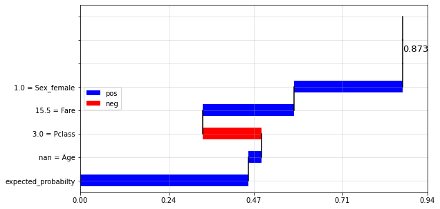


    === pred_q_(0.75, 1.0] | Registro #:  856
    Series([], Name: 4, dtype: float64)
    
    Prediction:  0.145
    


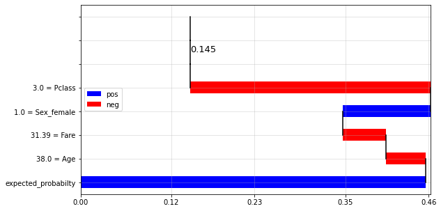


    === pred_q_(0.75, 1.0] | Registro #:  608
    Series([], Name: 5, dtype: float64)
    
    Prediction:  0.071
    


    === pred_q_(0.75, 1.0] | Registro #:  747
    Series([], Name: 6, dtype: float64)
    
    Prediction:  0.508
    


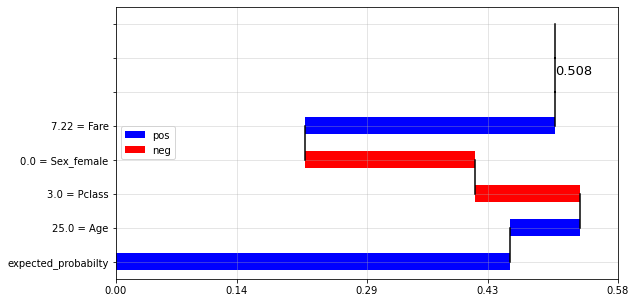


    === pred_q_(0.75, 1.0] | Registro #:  291
    Series([], Name: 7, dtype: float64)
    
    Prediction:  0.401
    


    === pred_q_(0.75, 1.0] | Registro #:  85
    Series([], Name: 8, dtype: float64)
    
    Prediction:  0.019
    


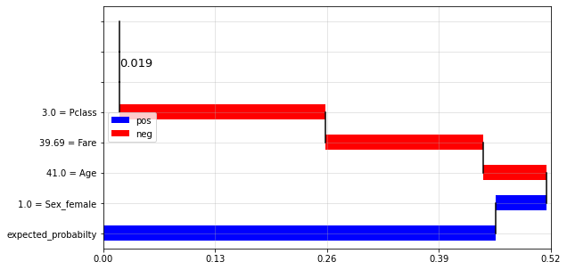


    === pred_q_(0.75, 1.0] | Registro #:  307
    Series([], Name: 9, dtype: float64)
    
    Prediction:  0.037
    


    === pred_q_(0.75, 1.0] | Registro #:  431
    Series([], Name: 10, dtype: float64)
    
    Prediction:  0.033
    


    === pred_q_(0.75, 1.0] | Registro #:  600
    Series([], Name: 11, dtype: float64)
    
    Prediction:  0.044
    


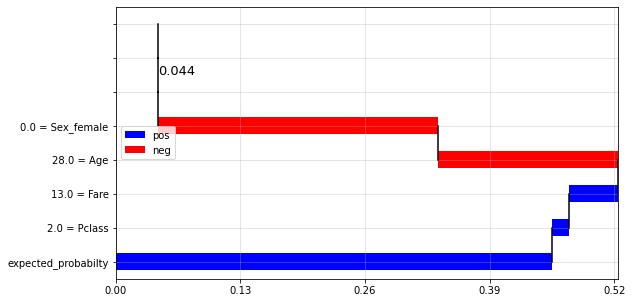


    === pred_q_(0.75, 1.0] | Registro #:  346
    Series([], Name: 12, dtype: float64)
    
    Prediction:  0.323
    


    === pred_q_(0.75, 1.0] | Registro #:  829
    Series([], Name: 13, dtype: float64)
    
    Prediction:  0.734
    


    === pred_q_(0.75, 1.0] | Registro #:  710
    Series([], Name: 14, dtype: float64)
    
    Prediction:  0.964
    


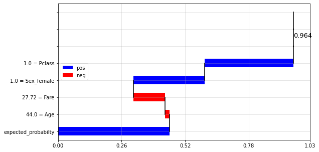


    === pred_q_(0.75, 1.0] | Registro #:  195
    Series([], Name: 15, dtype: float64)
    
    Prediction:  0.801
    


    === pred_q_(0.75, 1.0] | Registro #:  831
    Series([], Name: 16, dtype: float64)
    
    Prediction:  0.839
    


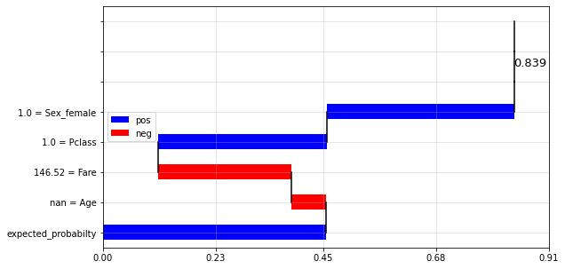


    === pred_q_(0.75, 1.0] | Registro #:  880
    Series([], Name: 17, dtype: float64)
    
    Prediction:  0.047
    


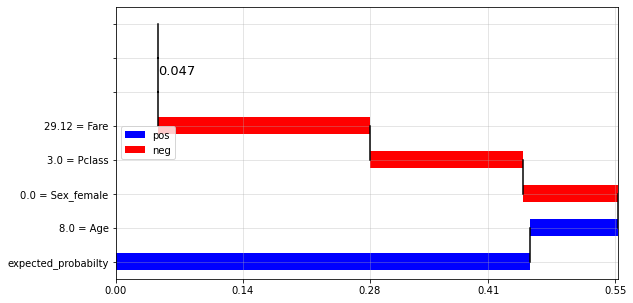


    === pred_q_(0.75, 1.0] | Registro #:  458
    Series([], Name: 18, dtype: float64)
    
    Prediction:  0.039
    


    === pred_q_(0.75, 1.0] | Registro #:  123
    Series([], Name: 19, dtype: float64)
    
    Prediction:  0.185
    


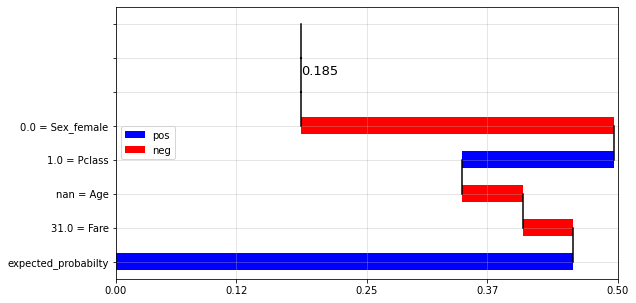


    ###  pred_q_(0.5, 0.75]
    
    === pred_q_(0.5, 0.75] | Registro #:  553
    Series([], Name: 0, dtype: float64)
    
    Prediction:  0.077
    


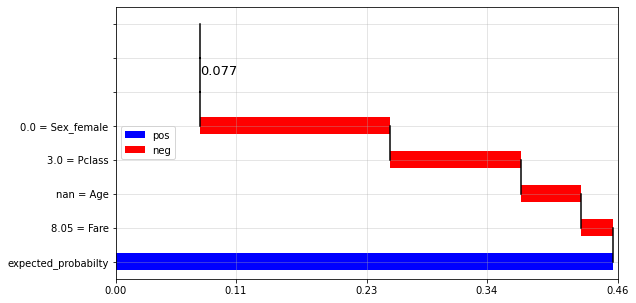


    === pred_q_(0.5, 0.75] | Registro #:  823
    Series([], Name: 1, dtype: float64)
    
    Prediction:  0.022
    


    === pred_q_(0.5, 0.75] | Registro #:  18
    Series([], Name: 2, dtype: float64)
    
    Prediction:  0.076
    


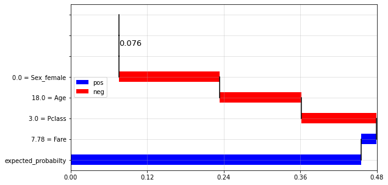


    === pred_q_(0.5, 0.75] | Registro #:  248
    Series([], Name: 3, dtype: float64)
    
    Prediction:  0.873
    


    === pred_q_(0.5, 0.75] | Registro #:  394
    Series([], Name: 4, dtype: float64)
    
    Prediction:  0.145
    


    === pred_q_(0.5, 0.75] | Registro #:  502
    Series([], Name: 5, dtype: float64)
    
    Prediction:  0.071
    


    === pred_q_(0.5, 0.75] | Registro #:  274
    Series([], Name: 6, dtype: float64)
    
    Prediction:  0.508
    


    === pred_q_(0.5, 0.75] | Registro #:  300
    Series([], Name: 7, dtype: float64)
    
    Prediction:  0.401
    


    === pred_q_(0.5, 0.75] | Registro #:  332
    Series([], Name: 8, dtype: float64)
    
    Prediction:  0.019
    


    === pred_q_(0.5, 0.75] | Registro #:  599
    Series([], Name: 9, dtype: float64)
    
    Prediction:  0.037
    


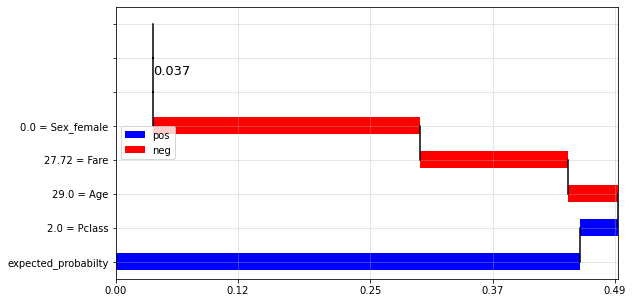


    === pred_q_(0.5, 0.75] | Registro #:  559
    Series([], Name: 10, dtype: float64)
    
    Prediction:  0.033
    


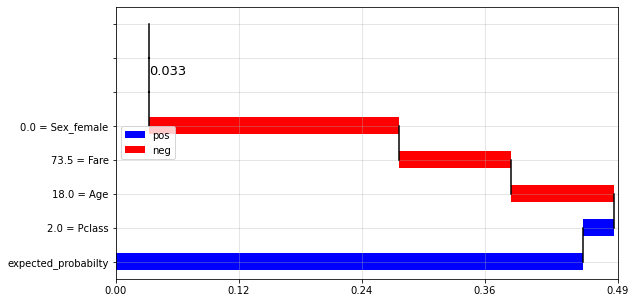


    === pred_q_(0.5, 0.75] | Registro #:  547
    Series([], Name: 11, dtype: float64)
    
    Prediction:  0.044
    


    === pred_q_(0.5, 0.75] | Registro #:  22
    Series([], Name: 12, dtype: float64)
    
    Prediction:  0.323
    


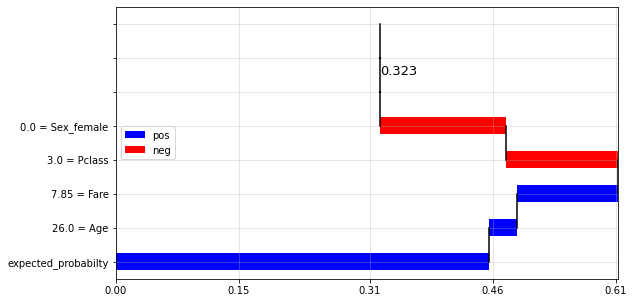


    === pred_q_(0.5, 0.75] | Registro #:  489
    Series([], Name: 13, dtype: float64)
    
    Prediction:  0.734
    


    === pred_q_(0.5, 0.75] | Registro #:  554
    Series([], Name: 14, dtype: float64)
    
    Prediction:  0.964
    


    === pred_q_(0.5, 0.75] | Registro #:  216
    Series([], Name: 15, dtype: float64)
    
    Prediction:  0.801
    


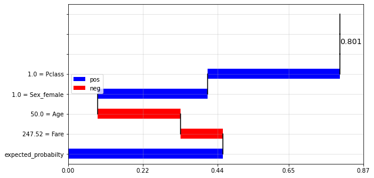


    === pred_q_(0.5, 0.75] | Registro #:  141
    Series([], Name: 16, dtype: float64)
    
    Prediction:  0.839
    


    === pred_q_(0.5, 0.75] | Registro #:  509
    Series([], Name: 17, dtype: float64)
    
    Prediction:  0.047
    


    === pred_q_(0.5, 0.75] | Registro #:  224
    Series([], Name: 18, dtype: float64)
    
    Prediction:  0.039
    


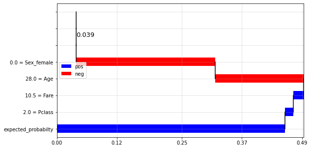


    === pred_q_(0.5, 0.75] | Registro #:  767
    Series([], Name: 19, dtype: float64)
    
    Prediction:  0.185
    


    ###  pred_q_(0.25, 0.5]
    
    === pred_q_(0.25, 0.5] | Registro #:  463
    Series([], Name: 0, dtype: float64)
    
    Prediction:  0.077
    


    === pred_q_(0.25, 0.5] | Registro #:  704
    Series([], Name: 1, dtype: float64)
    
    Prediction:  0.022
    


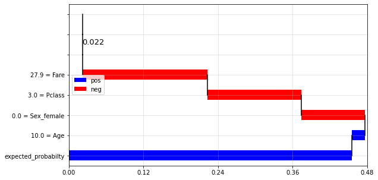


    === pred_q_(0.25, 0.5] | Registro #:  288
    Series([], Name: 2, dtype: float64)
    
    Prediction:  0.076
    


    === pred_q_(0.25, 0.5] | Registro #:  192
    Series([], Name: 3, dtype: float64)
    
    Prediction:  0.873
    


    === pred_q_(0.25, 0.5] | Registro #:  578
    Series([], Name: 4, dtype: float64)
    
    Prediction:  0.145
    


    === pred_q_(0.25, 0.5] | Registro #:  321
    Series([], Name: 5, dtype: float64)
    
    Prediction:  0.071
    


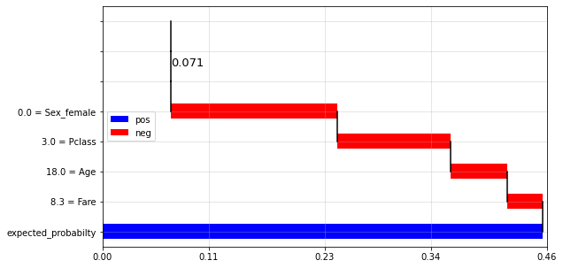


    === pred_q_(0.25, 0.5] | Registro #:  315
    Series([], Name: 6, dtype: float64)
    
    Prediction:  0.508
    


    === pred_q_(0.25, 0.5] | Registro #:  841
    Series([], Name: 7, dtype: float64)
    
    Prediction:  0.401
    


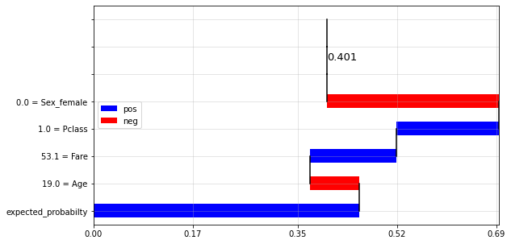


    === pred_q_(0.25, 0.5] | Registro #:  239
    Series([], Name: 8, dtype: float64)
    
    Prediction:  0.019
    


    === pred_q_(0.25, 0.5] | Registro #:  748
    Series([], Name: 9, dtype: float64)
    
    Prediction:  0.037
    


    === pred_q_(0.25, 0.5] | Registro #:  400
    Series([], Name: 10, dtype: float64)
    
    Prediction:  0.033
    


    === pred_q_(0.25, 0.5] | Registro #:  390
    Series([], Name: 11, dtype: float64)
    
    Prediction:  0.044
    


    === pred_q_(0.25, 0.5] | Registro #:  729
    Series([], Name: 12, dtype: float64)
    
    Prediction:  0.323
    


    === pred_q_(0.25, 0.5] | Registro #:  812
    Series([], Name: 13, dtype: float64)
    
    Prediction:  0.734
    


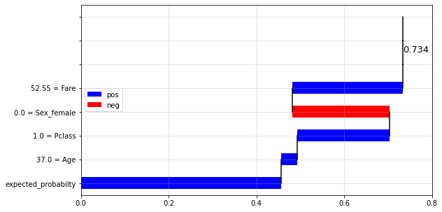


    === pred_q_(0.25, 0.5] | Registro #:  800
    Series([], Name: 14, dtype: float64)
    
    Prediction:  0.964
    


    === pred_q_(0.25, 0.5] | Registro #:  14
    Series([], Name: 15, dtype: float64)
    
    Prediction:  0.801
    


    === pred_q_(0.25, 0.5] | Registro #:  839
    Series([], Name: 16, dtype: float64)
    
    Prediction:  0.839
    


    === pred_q_(0.25, 0.5] | Registro #:  643
    Series([], Name: 17, dtype: float64)
    
    Prediction:  0.047
    


    === pred_q_(0.25, 0.5] | Registro #:  104
    Series([], Name: 18, dtype: float64)
    
    Prediction:  0.039
    


    === pred_q_(0.25, 0.5] | Registro #:  298
    Series([], Name: 19, dtype: float64)
    
    Prediction:  0.185
    


    ---------------------------------------------------------------------------

    ValueError                                Traceback (most recent call last)

    <ipython-input-4-fe9a5594674a> in <module>
    ----> 1 dicc_return = md.model_diagnostic(X_train,
          2                     y_train,
          3                     X_test,
          4                     y_test,
          5                     target,
    

    ~\Dropbox\GitHub dropbox\Scripts_Python\model_diagnostic_clean\model_diagnostic_utils.py in model_diagnostic(X_train, y_train, X_test, y_test, target, dir_results_files, dir_models, model_id, model_id2, umbral_elegido, umbral_elegido2, limit_imp, model_name, model_name2, data_for_comparison, porcentaje_df_sample, existing_shap_values, existing_df_shap_values, existing_shap_values_df_compare, existing_df_shap_values_df_compare, truncate_out, skew_validation_out_shap, use_normal_shap, sample_size_local_shap, return_model_metrics, return_feature_importance_gini, return_model_calibration_curve, return_compare_data_dist, return_performance_by_segment, return_profiling_false_negatives, return_shap, return_shap_df_compare, return_feature_importance_by_perm)
       1338 
       1339     if return_shap:
    -> 1340         shap_values,X,y,tree_shap_obj,dict_local_shap_rows = model_shap_analysis(features,
       1341                          X_train,
       1342                          y_train,
    

    ValueError: too many values to unpack (expected 5)


```python

```


```python

```


```python

```


```python

```


```python

```


```python

```
