```python
import model_diagnostic_utils as md
import pandas as pd
from sklearn.model_selection import train_test_split
```


```python
df = pd.read_csv('Titanic_train.csv')

df = pd.get_dummies(df,columns=['Sex'])
features = ['Pclass','Age','Sex_female','Fare']
target = 'Survived'
X = df[features]
y = df[target]
X_train, X_test, y_train, y_test = train_test_split(X, y, test_size=0.33, random_state=42)
```


```python
dir_results_files = 'results_files'
dir_models = 'models'

model_id = 'Your_user_name-21213528'
model_id2 = 'Your_user_name-21213533'

umbral_elegido = 0.5
umbral_elegido2 = 0.5

limit_imp = 5

model_name = 'Model 1'
model_name2 = 'Model 2'

data_for_comparison = df[list(X_train.columns)+[target]]
```


```python
dicc_return = md.model_diagnostic(X_train,
                    y_train,
                    X_test,
                    y_test,
                    target,
                    dir_results_files,
                    dir_models,
                    model_id,
                    model_id2,
                    umbral_elegido,
                    umbral_elegido2,
                    limit_imp,
                    model_name,
                    model_name2,
                    data_for_comparison,
                    porcentaje_df_sample=0.7,
                    existing_shap_values=None,
                    existing_df_shap_values=None,
                    existing_shap_values_df_compare=None,
                    existing_df_shap_values_df_compare=None,
                    truncate_out = 1,
                    skew_validation_out_shap = 0,
                    use_normal_shap=0,
                    sample_size_local_shap = 2,
                    return_model_metrics=1,
                    return_feature_importance_gini=1,
                    return_model_calibration_curve=1,
                    return_compare_data_dist=1,
                    return_performance_by_segment=0,
                    return_profiling_false_negatives=0,
                    return_shap=1,
                    return_shap_df_compare=0,
                    return_feature_importance_by_perm=0,
                    )
```

    
    ===== Mostrando Las metricas del modelo
    
    === Model 1
    Tipo_metrica          Clasificacion
    Tipo_modelo                       1
    Algoritmo             XGBClassifier
    umbral                          0.5
    AUC                        0.841667
    Gini                       0.683333
    F1_score                   0.761797
    Accuracy                   0.772881
    Recall                     0.762738
    Precision                  0.765568
    Fecha           2023-02-21 21:35:00
    Comentario                      NaN
    Name: Your_user_name-21213528, dtype: object
    
    == Confusion matrix
    --- Absoluto
    


    true_positive      85
    true_negative     158
    false_positive     17
    false_negative     35
    Name: result, dtype: int64


    
    --- Relativo
    


    true_positive     0.2881
    true_negative     0.5356
    false_positive    0.0576
    false_negative    0.1186
    Name: result, dtype: float64


    
    === Model 2
    Tipo_metrica          Clasificacion
    Tipo_modelo                       1
    Algoritmo             XGBClassifier
    umbral                          0.5
    AUC                         0.82381
    Gini                       0.647619
    F1_score                   0.738584
    Accuracy                   0.749153
    Recall                     0.740119
    Precision                  0.740949
    Fecha           2023-02-21 21:35:00
    Comentario                      NaN
    Name: Your_user_name-21213533, dtype: object
    
    == Confusion matrix
    --- Absoluto
    


    true_positive      88
    true_negative     150
    false_positive     25
    false_negative     32
    Name: result, dtype: int64


    
    --- Relativo
    


    true_positive     0.2983
    true_negative     0.5085
    false_positive    0.0847
    false_negative    0.1085
    Name: result, dtype: float64


    
    
    ===== Mostrando el feature importance by gini
    
    === Model 1
    


    
    === Model 2
    


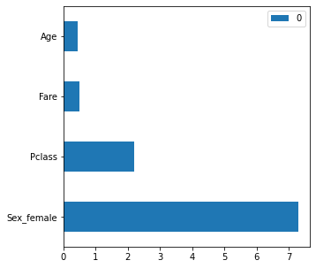


    
    ===== Mostrando la calibracion del modelo
    
    


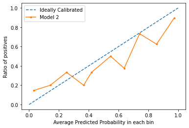


    
    ===== Comparando la distribucion de los features
    
    Pclass
    Media Data Training: 2.337248322147651 
     Media Data comparison: 2.308641975308642
    


    Con Pclass SON IGUALES
    
    -----------------------------
    
    Age
    Media Data Training: 29.525983263598327 
     Media Data comparison: 29.69911764705882
    


    Con Age SON IGUALES
    
    -----------------------------
    
    Sex_female
    Media Data Training: 0.34563758389261745 
     Media Data comparison: 0.35241301907968575
    


    Con Sex_female SON IGUALES
    
    -----------------------------
    
    Fare
    Media Data Training: 24.70657053726167 
     Media Data comparison: 24.517521586931093
    


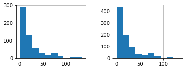


    Con Fare SON IGUALES
    
    -----------------------------
    
    
    ====== Creating shap values
    
    Sampling dataset
    
    Truncating outliers
    
    ====== Creating TREE shap values
    
    ======== TREE show_global_explainer
    


    
    ======== show_partial_dependence_plot
    Sex_female 0.9458186161236035
    


    Pclass -0.9050189344679586
    


    Age -0.5591775186214566
    


    Fare -0.14084235350715188
    


    
    ======== show_local_explainer_plot by type of prediction
    ###  true_positive
    
    === true_positive | Registro #:  726
    Series([], Name: 0, dtype: float64)
    
    Prediction:  0.105
    


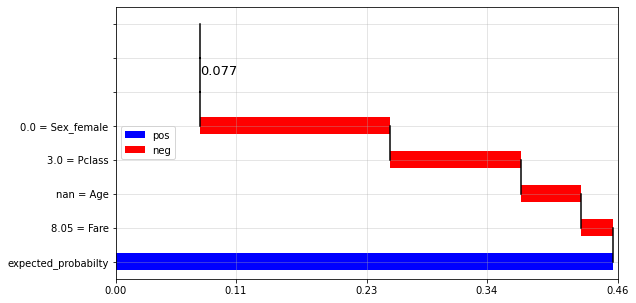


    === true_positive | Registro #:  417
    Series([], Name: 1, dtype: float64)
    
    Prediction:  0.74
    


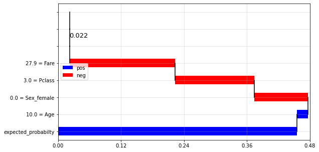


    ###  false_positive
    
    === false_positive | Registro #:  502
    Series([], Name: 0, dtype: float64)
    
    Prediction:  0.105
    


    === false_positive | Registro #:  657
    Series([], Name: 1, dtype: float64)
    
    Prediction:  0.74
    


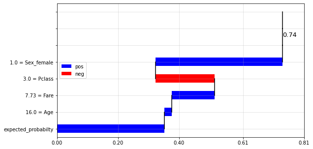


    ###  true_negative
    
    === true_negative | Registro #:  415
    Series([], Name: 0, dtype: float64)
    
    Prediction:  0.105
    


    === true_negative | Registro #:  182
    Series([], Name: 1, dtype: float64)
    
    Prediction:  0.74
    


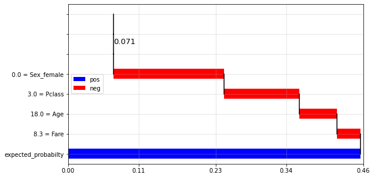


    ###  false_negative
    
    === false_negative | Registro #:  762
    Series([], Name: 0, dtype: float64)
    
    Prediction:  0.105
    


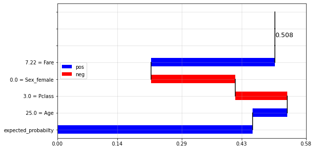


    === false_negative | Registro #:  647
    Series([], Name: 1, dtype: float64)
    
    Prediction:  0.74
    


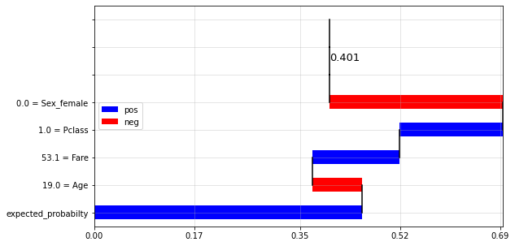


    ###  pred_q_(0.0, 0.25]
    
    === pred_q_(0.0, 0.25] | Registro #:  130
    Series([], Name: 0, dtype: float64)
    
    Prediction:  0.105
    


    === pred_q_(0.0, 0.25] | Registro #:  684
    Series([], Name: 1, dtype: float64)
    
    Prediction:  0.74
    


    ###  pred_q_(0.5, 0.75]
    
    === pred_q_(0.5, 0.75] | Registro #:  377
    Series([], Name: 0, dtype: float64)
    
    Prediction:  0.105
    


    === pred_q_(0.5, 0.75] | Registro #:  368
    Series([], Name: 1, dtype: float64)
    
    Prediction:  0.74
    


    ###  pred_q_(0.75, 1.0]
    
    === pred_q_(0.75, 1.0] | Registro #:  706
    Series([], Name: 0, dtype: float64)
    
    Prediction:  0.105
    


    === pred_q_(0.75, 1.0] | Registro #:  74
    Series([], Name: 1, dtype: float64)
    
    Prediction:  0.74
    


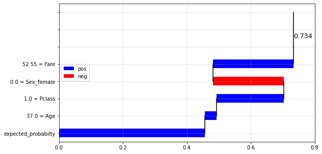


    ###  pred_q_(0.25, 0.5]
    
    === pred_q_(0.25, 0.5] | Registro #:  298
    Series([], Name: 0, dtype: float64)
    
    Prediction:  0.105
    


    === pred_q_(0.25, 0.5] | Registro #:  344
    Series([], Name: 1, dtype: float64)
    
    Prediction:  0.74
    


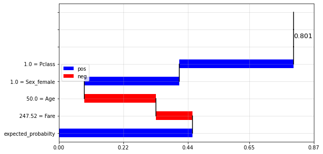


```python

```


```python

```


```python

```


```python

```


```python

```


```python

```
